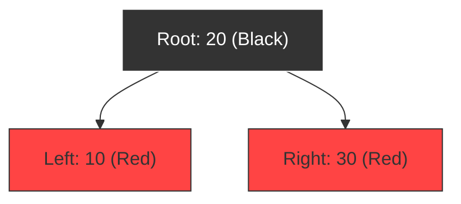

# Red-Black Tree balancing in TreeMap

## The Balancing Problem

If you insert sorted keys (like `10, 20, 30, 40`) into a standard Binary Search Tree, the tree grows in a single straight line, looking like a list:

```text
  [10]
    \
    [20]
      \
      [30]
```

This makes lookups slow ($\mathcal{O}(N)$ complexity). 

To prevent this, `TreeMap` uses a **Red-Black Tree**, which rebalances itself automatically as items are added.

---

## Red-Black Tree Rules

The tree colors nodes **Red** or **Black** and enforces strict rules:
1. The **Root** node must always be **Black**.
2. A **Red** node cannot have **Red** children (no two adjacent reds).
3. The number of black nodes from the root to any empty leaf must be equal along all paths.



---

## Rotations and rebalancing

If an insertion violates these rules, the JVM performs:
* **Color Flips**: Swapping red and black properties.
* **Rotations**: Shifting parent/child nodes left or right to re-align depth paths.

This guarantees that the tree depth remains balanced, keeping lookups fast at **$\mathcal{O}(\log N)$**.

---

**Back to TreeMap Home:** [TreeMap Index](README.md)
