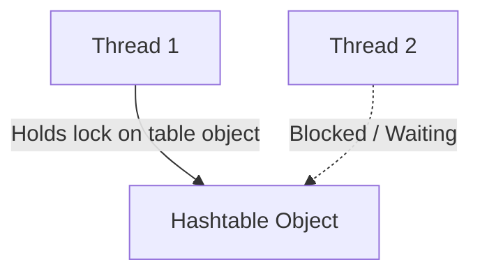

# Hashtable in Java: Basics and Operations

## Introduction

So far, we have covered `HashMap`, `LinkedHashMap`, and `TreeMap`. All of these collections are **not synchronized** and not thread-safe.

If multiple threads access an unsynchronized map concurrently and perform structural modifications (like adding or removing keys), the map can become corrupted or throw a `ConcurrentModificationException`.

To address thread safety in early Java versions, Java provided **`Hashtable`**. A `Hashtable` implements the `Map` interface, using internal monitor locks on its methods to guarantee thread safety.

---

## Hashtable Characteristics

* **Thread-Safe**: All public methods in `Hashtable` are marked as **`synchronized`**, meaning only one thread can execute operations on the map at any given time.
* **No Null Keys or Values**: **Does not allow `null` keys or `null` values**. If a null key or value is inserted, the map throws a `NullPointerException`.
* **Legacy Class**: Introduced in Java 1.0 (before JCF). It was later retrofitted to implement the `Map` interface in Java 1.2.
* **Unordered**: Does not guarantee any specific order of keys.

---

## Syntax and Basic Operations

To use `Hashtable`, import it from `java.util`:

```java
import java.util.Hashtable;
import java.util.Map;

public class Main {
    public static void main(String[] args) {
        Map<String, Integer> balances = new Hashtable<>();
        balances.put("Rahul", 5000);
        balances.put("Arun", 7500);

        // Attempting to put null throws NullPointerException
        // balances.put(null, 100); // Throws NPE!
        // balances.put("Priya", null); // Throws NPE!

        System.out.println("Balances Table: " + balances); // {Arun=7500, Rahul=5000}
    }
}
```

---

## Performance and Threading: Why Hashtable is Obsolete

While `Hashtable` provides thread safety, it does so by locking the entire table object during any read or write operation. This creates a severe performance bottleneck in multi-threaded environments:



### Modern Alternatives:
For modern concurrent applications, you should use:
1. **`ConcurrentHashMap`** (located in `java.util.concurrent`): Offers high concurrency through lock stripping (segment locking), allowing multiple threads to read and write concurrently without locking the entire table.
2. **`Collections.synchronizedMap()`**: Wraps an unsynchronized `HashMap` if explicit whole-map synchronization is required.

---

## Key Takeaways

* `Hashtable` is a legacy, synchronized class that implements the `Map` interface.
* Unlike `HashMap`, it does not permit `null` keys or `null` values.
* Due to synchronized method overhead, it is slow and considered obsolete.
* Use **`ConcurrentHashMap`** instead of `Hashtable` for high-performance concurrent applications.

---

**Back to Maps Home:** [Map Index](../README.md)
