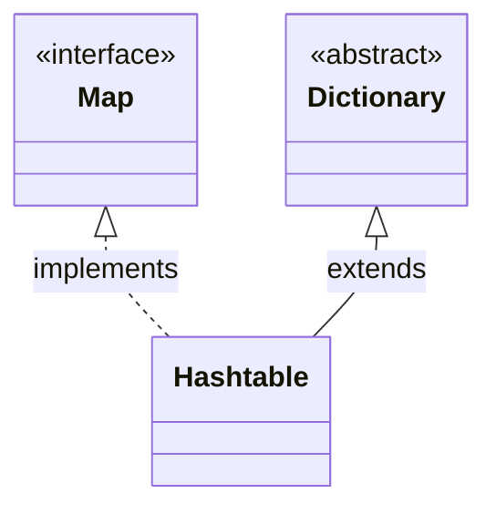

# Introduction to Hashtable in Java

## Overview

A `Hashtable` is a legacy, synchronized class in Java that stores key-value pairs. 

Introduced in Java 1.0, it was later retrofitted to implement the `Map` interface. While it operates similarly to `HashMap`, it uses method-level synchronization to guarantee thread safety in concurrent environments.

---

## Class Inheritance Hierarchy

---

## Hashtable Characteristics

* **Thread-Safe**: All public methods are synchronized, preventing concurrent access corruption.
* **No Null Keys or Values**: **Does not allow null keys or null values**. If you put null, Java throws a `NullPointerException`.
* **Legacy Class**: Extends the obsolete abstract class `Dictionary`.
* **Unordered**: Does not guarantee any specific order of keys.

---

**Back to HashTable Home:** [HashTable Index](README.md)
