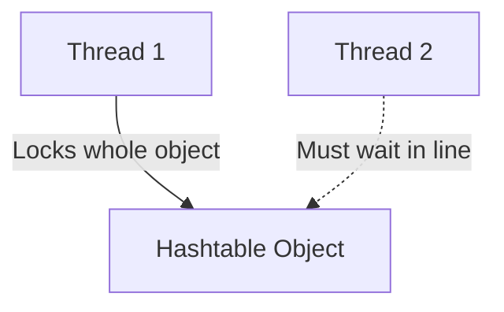

# Why Do We Need Hashtable?

## The Thread-Safety Problem

In Java, programs can run multiple tasks concurrently using **Threads**. 

If two threads try to add items to a standard `HashMap` at the exact same moment, the internal array can become corrupted, leading to lost data or infinite loops.

To prevent this, early Java versions introduced `Hashtable`.

---

## How Hashtable Helps

`Hashtable` locks the entire map when any thread executes an operation (like `put` or `get`). 

While Thread 1 is adding a value, Thread 2 is forced to wait until Thread 1 is completely finished. This ensures data consistency:

---

## Legacy Status Warning

Although `Hashtable` solved the thread-safety problem, locking the entire map makes it **very slow** in high-performance programs. 

Today, it is considered **obsolete**. Modern applications use **`ConcurrentHashMap`** instead, which only locks specific segments of the map, allowing threads to run much faster.

---

**Back to HashTable Home:** [HashTable Index](README.md)
