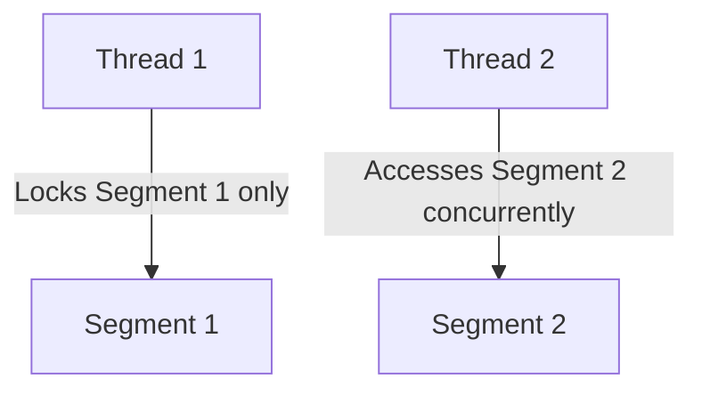

# Hashtable vs. HashMap

## Comparison Table

| Feature | `HashMap` | `Hashtable` |
| :--- | :--- | :--- |
| **Thread Safety** | ❌ No (Unsynchronized) | ✅ Yes (Synchronized methods) |
| **Null Key/Value** | ✅ Yes (Allowed) | ❌ No (Throws `NullPointerException`) |
| **Performance** | ⚡ Fast (No locking overhead) | 🐢 Slow (Object locking overhead) |
| **Iterator Type** | Fail-Fast | Fail-Safe (Enumeration) |

---

## Why Hashtable is Obsolete

`Hashtable` synchronizes by locking the **entire map object**. This means even if two threads want to read data from different buckets, they must wait in line. This creates a severe performance bottleneck.

### The Modern Solution: `ConcurrentHashMap`
If you need thread safety, never use `Hashtable`. Use **`ConcurrentHashMap`** (from `java.util.concurrent`) instead. It divides the map into segments and locks only the specific segment being written to (lock stripping), allowing multiple threads to read and write concurrently:

---

**Back to HashTable Home:** [HashTable Index](README.md)
