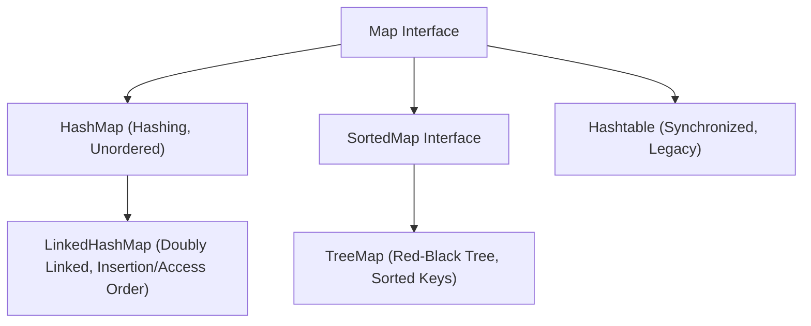

# Maps in Java

A **Map** represents an object that maps unique keys to values. A Map cannot contain duplicate keys; each key can map to at most one value. Unlike the other collection interfaces (`List`, `Set`, `Queue`), `Map` does not inherit from `Collection` or `Iterable`.

---

## Implementing Classes Map

### 1. [HashMap](01_HashMap/README.md) (Unordered, Default Choice)
* [HashMap Introduction](01_HashMap/01_Introduction.md) & [Why HashMap](01_HashMap/02_Why_HashMap.md)
* [Creating HashMap](01_HashMap/03_Creating_HashMap.md) & [Adding Elements](01_HashMap/04_Adding_Elements.md)
* [Accessing](01_HashMap/05_Accessing_Elements.md), [Updating](01_HashMap/06_Updating_Elements.md) & [Removing Elements](01_HashMap/07_Removing_Elements.md)
* [Iteration](01_HashMap/08_Iteration.md) & [Common Methods](01_HashMap/09_Common_Methods.md)
* [HashMap Internal Workings](01_HashMap/10_Internal_Working.md) & [Time Complexity](01_HashMap/11_Time_Complexity.md)
* [HashMap vs. HashTable](01_HashMap/12_HashMap_vs_HashTable.md) & [Comparisons / Q&As](01_HashMap/13_HashMap_vs_LinkedHashMap_vs_TreeMap.md)
* [HashMap Interview Questions](01_HashMap/14_Interview_Questions.md)

### 2. [LinkedHashMap](02_LinkedHashMap/README.md) (Preserves Insertion/Access Order)
* [LinkedHashMap Basics and Operations](02_LinkedHashMap/01_LinkedHashMap-Basics-and-Operations.md): Preserving ordering and access-ordering mode.
* [LinkedHashMap Internal Workings](02_LinkedHashMap/02_LinkedHashMap-Internal-Workings-and-Comparison.md): Doubly-linked bucket nodes, LRU caching implementation (`removeEldestEntry()`), and comparison tables.

### 3. [TreeMap](03_TreeMap/README.md) (Sorted Key Ordering)
* [TreeMap Basics and Operations](03_TreeMap/01_TreeMap-Basics-and-Operations.md): NavigableMap range query APIs.
* [TreeMap Internal Workings](03_TreeMap/02_TreeMap-Internal-Workings-and-Comparison.md): Red-Black self-balancing BST model, rotations, color flips, and comparisons.

### 4. [Hashtable](04_HashTable/01_HashTable-Basics-and-Operations.md) (Thread-safe monitor lock, Obsolete)
* [Hashtable Basics and Operations](04_HashTable/01_HashTable-Basics-and-Operations.md): Synchronized operations, null key restrictions, why it is obsolete, and ConcurrentHashMap alternatives.

---

## Map Implementations Summary

---

**Back to Module Home:** [Collection Framework Index](../README.md)
