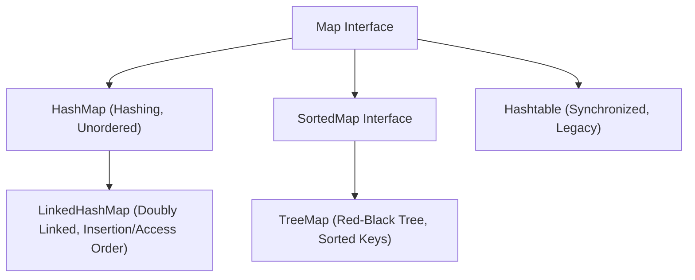

# Maps in Java

A **Map** represents an object that maps unique keys to values. A Map cannot contain duplicate keys; each key can map to at most one value. Unlike the other collection interfaces (`List`, `Set`, `Queue`), `Map` does not inherit from `Collection` or `Iterable`.

---

## Implementing Classes Map

### 1. [HashMap](01_HashMap/README.md) (Unordered, Default Choice)
* [HashMap Introduction](01_HashMap/01_Introduction.md) & [Why HashMap](01_HashMap/02_Why_HashMap.md)
* [Creating HashMap](01_HashMap/03_Creating_HashMap.md) & [Adding Elements](01_HashMap/04_Adding_Elements.md)
* [Accessing](01_HashMap/05_Accessing_Elements.md), [Updating](01_HashMap/06_Updating_Elements.md) & [Removing Elements](01_HashMap/07_Removing_Elements.md)
* [Iteration](01_HashMap/08_Iteration.md) & [Common Methods](01_HashMap/09_Common_Methods.md)
* [HashMap Internal Workings](01_HashMap/10_Internal_Working.md) & [Time Complexity](01_HashMap/11_Time_Complexity.md)
* [HashMap vs. HashTable](01_HashMap/12_HashMap_vs_HashTable.md) & [Comparisons / Q&As](01_HashMap/13_HashMap_vs_LinkedHashMap_vs_TreeMap.md)
* [HashMap Interview Questions](01_HashMap/14_Interview_Questions.md)

### 2. [LinkedHashMap](02_LinkedHashMap/README.md) (Preserves Insertion/Access Order)
* [LinkedHashMap Introduction](02_LinkedHashMap/01_Introduction.md) & [Why LinkedHashMap](02_LinkedHashMap/02_Why_LinkedHashMap.md)
* [Creating LinkedHashMap](02_LinkedHashMap/03_Creating_LinkedHashMap.md) & [Adding](02_LinkedHashMap/04_Adding_Elements.md) / [Accessing Elements](02_LinkedHashMap/05_Accessing_Elements.md)
* [Updating](02_LinkedHashMap/06_Updating_Elements.md) & [Removing Elements](02_LinkedHashMap/07_Removing_Elements.md)
* [Iteration](02_LinkedHashMap/08_Iteration.md) & [Internal Working](02_LinkedHashMap/09_Internal_Working.md)
* [Comparison with HashMap](02_LinkedHashMap/10_Comparison_with_HashMap.md) & [Interview Questions](02_LinkedHashMap/11_Interview_Questions.md)

### 3. [TreeMap](03_TreeMap/README.md) (Sorted Key Ordering)
* [TreeMap Introduction](03_TreeMap/01_Introduction.md) & [Why TreeMap](03_TreeMap/02_Why_TreeMap.md)
* [Creating TreeMap](03_TreeMap/03_Creating_TreeMap.md) & [Adding](03_TreeMap/04_Adding_Elements.md) / [Accessing Elements](03_TreeMap/05_Accessing_Elements.md)
* [Updating](03_TreeMap/06_Updating_Elements.md) & [Removing Elements](03_TreeMap/07_Removing_Elements.md)
* [Iteration](03_TreeMap/08_Iteration.md) & [NavigableMap Methods](03_TreeMap/09_NavigableMap_Methods.md)
* [Internal Working](03_TreeMap/10_Internal_Working.md) & [Red-Black Tree balancing](03_TreeMap/11_Red_Black_Tree.md)
* [Comparison with HashMap](03_TreeMap/12_Comparison_with_HashMap.md) & [Interview Questions](03_TreeMap/13_Interview_Questions.md)

### 4. [Hashtable](04_HashTable/01_HashTable-Basics-and-Operations.md) (Thread-safe monitor lock, Obsolete)
* [Hashtable Basics and Operations](04_HashTable/01_HashTable-Basics-and-Operations.md): Synchronized operations, null key restrictions, why it is obsolete, and ConcurrentHashMap alternatives.

---

## Map Implementations Summary

---

**Back to Module Home:** [Collection Framework Index](../README.md)
