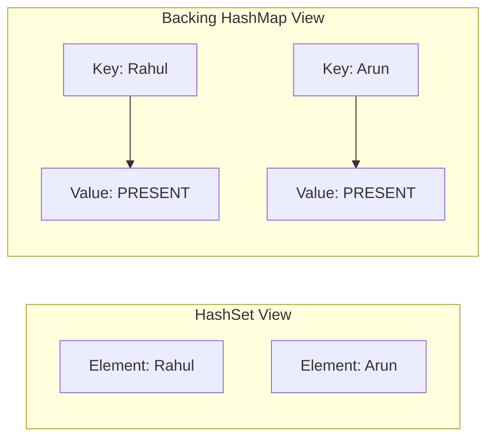

# Internal Working of HashSet

## The Backing HashMap

A `HashSet` does not actually implement hash table logic from scratch. Instead, it wraps a private, transient **`HashMap`** instance:

```java
// Conceptual view of HashSet.java source code:
public class HashSet<E> extends AbstractSet<E> implements Set<E> {
    private transient HashMap<E, Object> map;

    // Dummy value to associate with an Object in the backing Map
    private static final Object PRESENT = new Object();

    public HashSet() {
        map = new HashMap<>();
    }
}
```

Every element you insert into a `HashSet` becomes a **Key** in the backing `HashMap`. The **Value** for every key is a dummy static object named `PRESENT`:



---

## How Operations Map Internally

When you call HashSet methods, they are directly routed to the backing map:

### 1. The `add(E e)` implementation:
```java
public boolean add(E e) {
    return map.put(e, PRESENT) == null;
}
```
* If `map.put()` returns `null`, the key was not present, meaning the item was successfully added (returns `true`).
* If `map.put()` returns the old value (`PRESENT`), the key was already present, so the duplicate is rejected (returns `false`).

### 2. The `contains(Object o)` implementation:
```java
public boolean contains(Object o) {
    return map.containsKey(o);
}
```
Delegates to the hash table bucket check in `HashMap`, running in constant `O(1)` average time.

### 3. The `remove(Object o)` implementation:
```java
public boolean remove(Object o) {
    return map.remove(o) == PRESENT;
}
```

---

## Memory Overhead

Because a `HashSet` instantiates a full `HashMap.Entry` node for every element (which contains keys, values, hashes, and next pointers), it consumes significantly more heap memory than a simple array representation.

---

**Back to Sets Home:** [Sets Index](../README.md)
