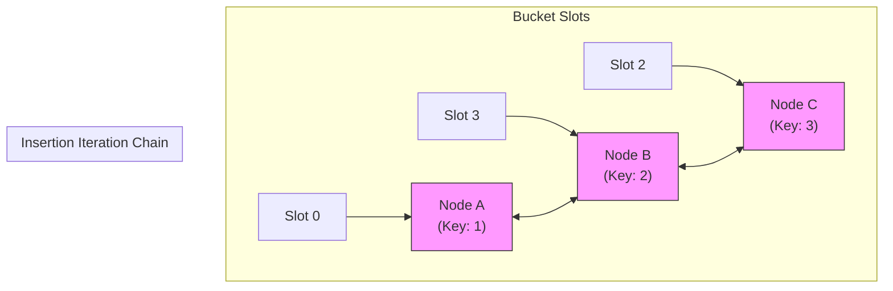

# Internal Working of LinkedHashSet

## The Constructor Redirection

Although `LinkedHashSet` extends `HashSet`, it bypasses the standard `HashMap` initialization constructor. Instead, it calls a package-private constructor inside `HashSet.java`:

```java
// Constructor inside LinkedHashSet.java:
public LinkedHashSet() {
    super(16, .75f, true); // Redirects to special package-private parent constructor
}
```

```java
// Special constructor inside HashSet.java:
HashSet(int initialCapacity, float loadFactor, boolean dummy) {
    map = new LinkedHashMap<>(initialCapacity, loadFactor); // Instantiates a LinkedHashMap!
}
```

Every element you insert into a `LinkedHashSet` becomes a **Key** in the backing **`LinkedHashMap`**, using the same dummy object `PRESENT` as the value.

---

## Double Linked Hashing Nodes

Because it uses a `LinkedHashMap` internally, each element in the set resides in a bucket and contains two extra pointer references (`before` and `after`):



When you iterate through a `LinkedHashSet`, Java does not scan bucket slots sequentially. Instead, it follows the `before` and `after` pointers, ensuring elements are visited in the exact sequence they were added.

---

## Performance Cost

* **Insertion/Deletion**: Slightly slower than `HashSet` because it must update the `before` and `after` pointers when inserting or removing elements.
* **Traversal**: Faster than `HashSet` on average because it only traverses the populated nodes, skipping empty bucket slots.

---

**Back to Sets Home:** [Sets Index](../README.md)
