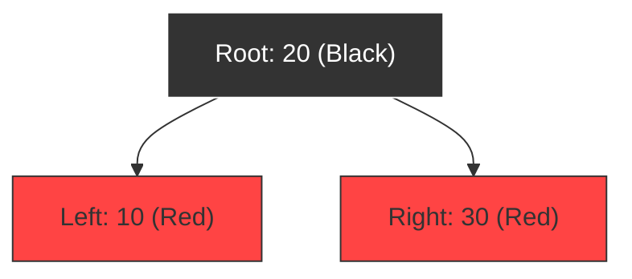

# Internal Working of TreeSet

## The Backing TreeMap

Like `HashSet`, a `TreeSet` does not implement tree logic from scratch. Instead, it wraps a **`TreeMap`** instance:

```java
// Conceptual view of TreeSet.java source code:
public class TreeSet<E> extends AbstractSet<E> implements NavigableSet<E> {
    private transient NavigableMap<E,Object> m;

    // Dummy value to associate with an Object in the backing Map
    private static final Object PRESENT = new Object();

    public TreeSet() {
        this(new TreeMap<>()); // Backed by a TreeMap!
    }

    TreeSet(NavigableMap<E,Object> m) {
        this.m = m;
    }
}
```

Every element you insert into a `TreeSet` becomes a **Key** in the backing `TreeMap`. The **Value** for every key is the dummy object `PRESENT`.

---

## Logarithmic Performance: `O(log N)`

Because it uses a `TreeMap` internally, elements are stored as nodes in a self-balancing **Red-Black Binary Search Tree**:



When you add or check for an element:
1. The JVM compares the new element with the root node.
2. If it is smaller, it branches left; if larger, it branches right.
3. This traversal continues until it finds the matching key or the insertion point.
4. Because the tree is balanced, the search path is guaranteed to be logarithmic **`O(log N)`**.

---

## Comparison Operations

To compare elements, `TreeSet` uses:
* The element's custom **`compareTo()`** implementation (if using natural ordering via `Comparable`).
* An external **`compare()`** method (if a custom `Comparator` was passed to the constructor).

If `compareTo()` or `compare()` returns `0`, the element is identified as a duplicate and rejected. **`equals()` is not used for duplicates in a TreeSet.**

---

**Back to Sets Home:** [Sets Index](../README.md)
