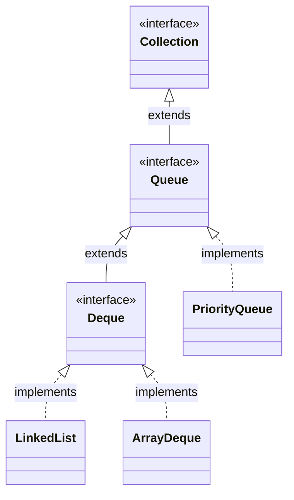

# Queue Interface in Java

## Introduction

In programming, we often need to process elements in a first-in, first-out sequence—such as processing incoming network packets, handling requests in a web server, or scheduling print jobs.

The Java Collection Framework (JCF) provides the **`Queue`** interface to represent collections designed for holding elements prior to processing.

---

## Why Queue?

Unlike a List where you can insert or retrieve elements at any random index, a `Queue` enforces strict access rules. Elements are appended to the **tail** (end) of the queue and retrieved from the **head** (front) of the queue. This prevents out-of-order processing, making it ideal for message routing and task pipelines.

---

## The FIFO Principle

A standard queue operates on the **First-In, First-Out (FIFO)** principle:

```text
Enqueue (offer) ──> [Tail]  [ ]  [ ]  [ ]  [Head] ──> Dequeue (poll)
                    Item 4  Item 3  Item 2  Item 1
```

The first element added to the queue is the first one removed.

---

## Queue Class Hierarchy



---

## Creating a Queue

Since `Queue` is an interface, you cannot instantiate it directly. Instead, you instantiate one of its implementations:

### 1. Using LinkedList (Standard FIFO Queue)
```java
import java.util.LinkedList;
import java.util.Queue;

Queue<String> queue = new LinkedList<>();
```

### 2. Using ArrayDeque (Standard FIFO Queue, faster than LinkedList)
```java
import java.util.ArrayDeque;
import java.util.Queue;

Queue<String> queue = new ArrayDeque<>();
```

---

## Common Methods

The `Queue` interface defines two sets of methods for adding, removing, and inspecting elements. One set throws an exception if the operation fails, while the other returns a special value (like `null` or `false`):

| Operation | Throws Exception | Returns Special Value |
| :--- | :---: | :---: |
| **Insert** (Add to tail) | `add(e)` | `offer(e)` |
| **Remove** (Remove from head) | `remove()` | `poll()` |
| **Examine** (Inspect head) | `element()` | `peek()` |

---

## Complete Programs

### Example: Basic FIFO Operations
```java
import java.util.ArrayDeque;
import java.util.Queue;

public class QueueDemo {
    public static void main(String[] args) {
        Queue<String> customerLine = new ArrayDeque<>();

        // 1. Enqueue elements
        customerLine.offer("Rahul");
        customerLine.offer("Amit");
        customerLine.offer("Priya");

        System.out.println("Customer Line: " + customerLine); // [Rahul, Amit, Priya]

        // 2. Inspect head
        System.out.println("Next customer to serve: " + customerLine.peek()); // Rahul

        // 3. Dequeue elements
        System.out.println("Served: " + customerLine.poll()); // Rahul
        System.out.println("Served: " + customerLine.poll()); // Amit

        System.out.println("Remaining Line: " + customerLine); // [Priya]
    }
}
```

---

## Best Practices

* **Use `offer()`, `poll()`, and `peek()`**: Prefer these methods over `add()`, `remove()`, and `element()` to avoid writing try-catch blocks for normal queue operations.
* **Prefer ArrayDeque over LinkedList**: When implementing a standard FIFO queue, `ArrayDeque` is faster and consumes less memory because it does not require allocating node objects for every element.

---

## Common Mistakes

* **Adding Nulls**: Do not insert `null` elements into a queue. Methods like `poll()` and `peek()` return `null` to indicate the queue is empty, so storing `null` values makes it impossible to check if the queue is empty.
* **Random Access**: Do not cast a `Queue` to a `List` to retrieve elements by index. This violates the Queue design pattern.

---

## Key Takeaways

* The `Queue` interface represents collections designed for FIFO processing.
* Standard implementations include `ArrayDeque` and `LinkedList`.
* Safe methods (`offer`, `poll`, `peek`) return special values instead of throwing exceptions.

---

**Back to Queues Home:** [Queues Index](../README.md)
