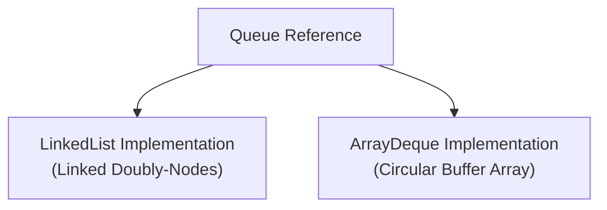

# Internal Working of Queue Implementations

## Implementation Backings

Because `Queue` is an interface, its internal structure depends on the chosen concrete implementation class:



---

## 1. LinkedList Backing (Linked Pointer Architecture)

When you use `LinkedList` as a Queue:
* It maintains a reference to both `first` (head) and `last` (tail) nodes.
* **`offer()`** creates a new `Node` object and appends it to the tail by updating the current tail's `next` pointer.
* **`poll()`** retrieves the head node, updates the head reference to `head.next`, and dereferences the old node.

```text
Memory Nodes:
[Head] Node A <--> Node B <--> Node C [Tail]
```

---

## 2. ArrayDeque Backing (Circular Array Architecture)

When you use `ArrayDeque` as a Queue:
* It stores elements in a resizable array.
* It maintains two integer indices: `head` (pointing to the front element) and `tail` (pointing to the next available slot).
* **Circular Indexing**: When elements are added or removed, `head` and `tail` wrap around the array boundaries using bitwise arithmetic, avoiding shifting elements.

```text
Circular Array Slots:
Index:   [0]   [1]   [2]   [3]   [4]   [5]   [6]   [7]
Data:   [ C ] [ D ] [   ] [   ] [   ] [   ] [ A ] [ B ]
                     ^                     ^
                    Tail                  Head
```

---

## Performance Complexities

| Method | `LinkedList` | `ArrayDeque` |
| :--- | :---: | :---: |
| **`offer()`** | `O(1)` | `O(1)` amortized |
| **`poll()`** | `O(1)` | `O(1)` |
| **`peek()`** | `O(1)` | `O(1)` |
| **Memory Allocation** | High (creates Node objects) | Low (reuses array slots) |

---

**Back to Queues Home:** [Queues Index](../README.md)
