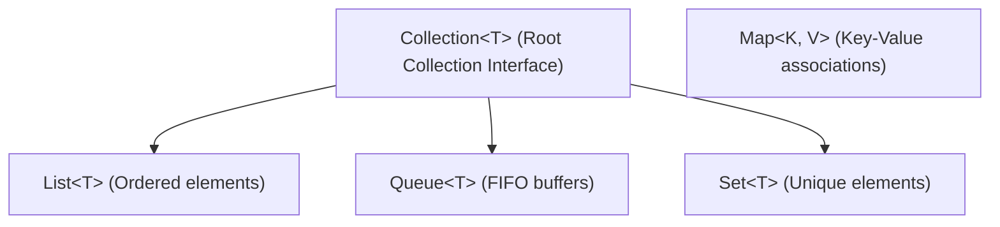

# Module 10: Collection Framework in Java

Welcome to the **Collection Framework in Java** module! This guide outlines the learning objectives, lesson structure, collection types, and core comparison FAQs for storing, managing, and sorting data objects in Java.

---

## Learning Objectives

By the end of this module, you will understand:
1. **JCF Architecture**: The distinction between collections (Lists, Sets, Queues) and Maps.
2. **ArrayList**: Contiguous resizable array memory management and time complexities.
3. **LinkedList**: Doubly linked node structure, pointer updates, and traversal strategies.
4. **Collections Utility**: Leveraging the final static helper class for sorting and searching.
5. **Comparable & Comparator**: Defining default natural ordering vs. external custom sorting.
6. **Autoboxing/Unboxing**: Automatic wrapping and unwrapping between primitives and heap-allocated objects.

---

## Lessons Map

### 1. Introduction and Core Concepts
* [JCF Introduction - Part 1](01_Collections-Framework-Introduction-Part1.md): Array limitations, why Collections are needed, and core Iterable/Collection properties.
* [JCF Introduction - Part 2](02_Collections-Framework-Introduction-Part2.md): The full class and interface hierarchy map (List, Set, Queue, and Map).
* [Collections Utility Class](03_Collections-Utility-Class.md): Static algorithms for searching, sorting, reversing, and frequency analysis.
* [Comparable Interface](04_Comparable-vs-Comparator-Part1.md): Natural ordering implementation inside the custom class block.
* [Comparator Interface](05_Comparable-vs-Comparator-Part2.md): Custom, alternative sorting rules external to the class, anonymous classes, and Lambda expressions.
* [Autoboxing and Unboxing](06_Autoboxing-and-Unboxing.md): Converting primitive data types to wrapper classes automatically.

### 2. Lists Implementations
* **ArrayList Subfolder**: [ArrayList Basics](04_ArrayList/README.md)
  1. [ArrayList Basics](04_ArrayList/01_ArrayList-Basics.md): Characteristics, constructors, and syntax.
  2. [ArrayList Methods - Part 1](04_ArrayList/02_ArrayList-Methods-Part1.md): Core adding, getting, and querying methods.
  3. [ArrayList Methods - Part 2](04_ArrayList/03_ArrayList-Methods-Part2.md): Removals, memory optimizations, and array conversions.
  4. [ArrayList Traversal and Sorting](04_ArrayList/04_ArrayList-Traversal-and-Sorting.md): Iterators, ListIterators, sorting, and binary search rules.
  5. [ArrayList Internal Workings](04_ArrayList/05_ArrayList-Internal-Workings.md): Dynamic growth math, capacity resizing steps, and time complexities.
* **LinkedList Subfolder**: [LinkedList Basics](06_LinkedList/README.md)
  1. [LinkedList Introduction and Creation](06_LinkedList/01_LinkedList-Introduction-and-Creation.md): Doubly linked nodes vs. arrays, syntax, and custom objects.
  2. [LinkedList Basic Operations](06_LinkedList/02_LinkedList-Basic-Operations.md): Core add, get, peek, element, and remove operations.
  3. [LinkedList Iteration](06_LinkedList/03_LinkedList-Iteration.md): Iterators, list iterators, and the $\mathcal{O}(N^2)$ traversal warning.
  4. [LinkedList Internal Workings](06_LinkedList/04_LinkedList-Internal-Workings.md): Doubly linked pointers, node structural layouts, and pointer swap updates.
  5. [LinkedList vs. ArrayList](06_LinkedList/05_LinkedList-vs-ArrayList.md): Direct runtime and memory complexity comparisons.
  6. [LinkedList Interview Questions](06_LinkedList/06_LinkedList-Interview-Questions.md): CONFIDENT answers to technical FAQs and scenario-based inquiries.

### 3. Key-Value Maps
* **Maps Subfolder**: [Maps Overview](07_Maps/README.md)
  1. [HashMap Introduction](07_Maps/01_HashMap/01_Introduction.md) & [Operations](07_Maps/01_HashMap/04_Adding_Elements.md)
  2. [HashMap Internal Workings](07_Maps/01_HashMap/10_Internal_Working.md) & [Comparisons / Q&As](07_Maps/01_HashMap/13_HashMap_vs_LinkedHashMap_vs_TreeMap.md)
  3. [LinkedHashMap Basics](07_Maps/02_LinkedHashMap/01_Introduction.md) & [Internal Workings](07_Maps/02_LinkedHashMap/09_Internal_Working.md)
  4. [TreeMap Basics](07_Maps/03_TreeMap/01_Introduction.md) & [Internal Workings](07_Maps/03_TreeMap/10_Internal_Working.md)
  5. [Hashtable Basics](07_Maps/04_HashTable/01_Introduction.md) & [Internal Workings](07_Maps/04_HashTable/05_Internal_Working.md)

### 4. Unique Sets
* **Sets Subfolder**: [Sets Overview](08_Sets/README.md)
  1. [HashSet Basics](08_Sets/01_HashSet/01_HashSet.md) & [Internal Workings](08_Sets/01_HashSet/02_Internal_Working.md)
  2. [LinkedHashSet Basics](08_Sets/02_LinkedHashSet/01_LinkedHashSet.md) & [Internal Workings](08_Sets/02_LinkedHashSet/02_Internal_Working.md)
  3. [TreeSet Basics](08_Sets/03_TreeSet/01_TreeSet.md) & [Internal Workings](08_Sets/03_TreeSet/02_Internal_Working.md)

---

## Core JCF Structural Architecture

---

*Collections. Efficiency. Algorithms.*
