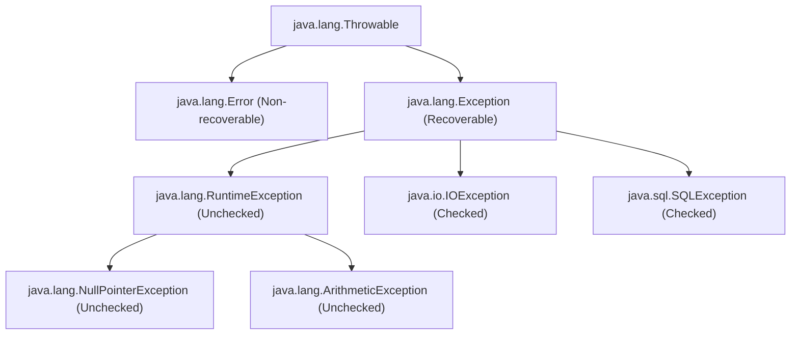

# Introduction to Exceptions in Java

## Throwable Hierarchy

In Java, all anomalies that interrupt the normal flow of instruction execution are represented by classes extending the **`Throwable`** class. The hierarchy is organized as follows:



---

## Errors vs. Exceptions

| Feature | Error | Exception |
| :--- | :--- | :--- |
| **Recovery** | Non-recoverable. | Recoverable using `try-catch` handling. |
| **Origin** | Severe system-level resource depletion or JVM issues. | Application-level logic errors or external environments. |
| **Examples** | `OutOfMemoryError`, `StackOverflowError`. | `NullPointerException`, `FileNotFoundException`. |

---

## Checked vs. Unchecked Exceptions

Java divides exceptions into two main categories:

### 1. Checked Exceptions (Compile-time Exceptions)
Checked exceptions are verified by the compiler. If a method performs an operation that can throw a checked exception, the compiler requires the programmer to handle it (using `try-catch`) or declare it (using `throws`).
* **Why**: To force developers to write recovery logic for external issues that are outside the application's control (e.g., file system access or database connections).
* **Examples**: `IOException`, `SQLException`, `FileNotFoundException`.

### 2. Unchecked Exceptions (Runtime Exceptions)
Unchecked exceptions are classes that inherit from `RuntimeException`. The compiler does not verify if these are handled or declared.
* **Why**: These are typically caused by programming logic errors, which should be resolved by fixing the code rather than writing recovery blocks.
* **Examples**: `NullPointerException`, `ArrayIndexOutOfBoundsException`, `ArithmeticException`.

```java
// Example: Checked exception requires handling or declaration
import java.io.FileReader;
import java.io.FileNotFoundException;

public class CheckedDemo {
    public static void main(String[] args) {
        // Compiler error: Unhandled exception type FileNotFoundException
        // FileReader reader = new FileReader("non_existent_file.txt");
    }
}
```

---

## Key Takeaways

* All exceptional events in Java extend `Throwable`.
* **Errors** represent fatal system failures. **Exceptions** represent conditions that a programmer should handle.
* **Checked exceptions** are checked at compile time; **unchecked exceptions** are runtime conditions extending `RuntimeException`.

---

**Back to Module Home:** [Module Index](README.md)
