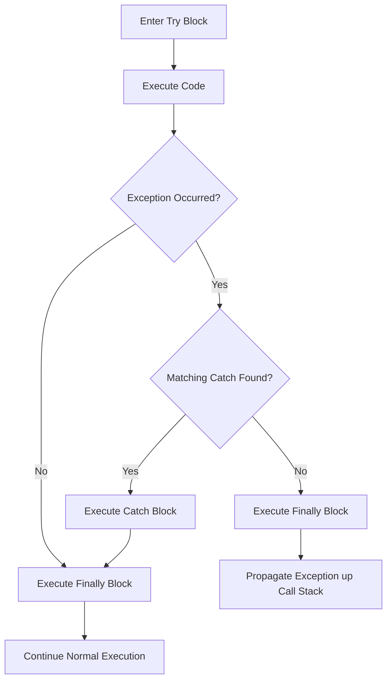

# Try-Catch-Finally in Java

## Syntax Structure

The try-catch-finally construct provides the structure for enclosing exception-prone statements, defining recovery strategies, and guaranteeing resource cleanup.

```java
try {
    // Exception-prone code block
} catch (SpecificException e) {
    // Specific recovery block
} catch (GeneralException e) {
    // General recovery fallback block
} finally {
    // Execution block that always runs
}
```

---

## Execution Flow



---

## Multiple Catch Blocks

When handling code that can throw different types of exceptions, you can define multiple `catch` blocks.
* **Important Rule**: **Catch blocks must be ordered from specific to general.**
* If a parent exception class (like `Exception`) is placed before a child exception class (like `ArithmeticException`), the compiler will throw an error because the child catch block is unreachable.

```java
public class MultiCatchDemo {
    public static void main(String[] args) {
        try {
            int[] numbers = new int[5];
            numbers[5] = 30 / 0; // Throws ArithmeticException
        } catch (ArithmeticException e) {
            System.out.println("ArithmeticException handled: " + e.getMessage());
        } catch (ArrayIndexOutOfBoundsException e) {
            System.out.println("IndexOutOfBoundsException handled: " + e.getMessage());
        } catch (Exception e) {
            System.out.println("General Exception handled: " + e.getMessage());
        }
    }
}
```

---

## The Finally Block

The `finally` block **always executes**, whether an exception is thrown or caught. This makes it the ideal place for closing database connections, file streams, or sockets.

### Behavior During `return` Statements
If a `return` statement is encountered inside a `try` or `catch` block, the JVM executes the `finally` block **before** transferring control back to the calling method.

```java
public class FinallyReturnDemo {
    public static int testMethod() {
        try {
            System.out.println("Inside Try Block");
            return 10;
        } finally {
            System.out.println("Inside Finally Block");
        }
    }

    public static void main(String[] args) {
        System.out.println("Returned Value: " + testMethod());
    }
}
```

**Output:**
```text
Inside Try Block
Inside Finally Block
Returned Value: 10
```

---

## Key Takeaways

* Code prone to exceptions belongs in a `try` block.
* `catch` blocks handle exceptions, ordered from specific subclasses to general superclasses.
* The `finally` block is guaranteed to execute, running before return values are sent back.

---

**Back to Module Home:** [Module Index](README.md)
