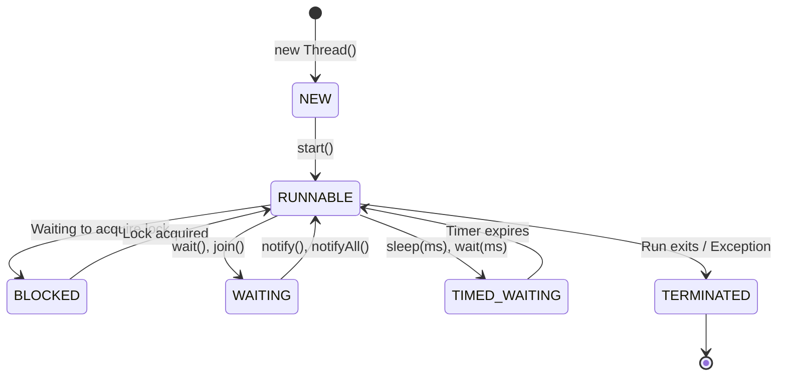

# Introduction to Multithreading in Java

## Concurrency vs. Parallelism

Understanding the difference between concurrency and parallelism is fundamental to concurrent programming:

* **Concurrency**: The ability to run multiple tasks by interleaving their execution on a single core CPU (logical multitasking). It is about **structure** and managing multiple tasks at once.
* **Parallelism**: The execution of multiple tasks simultaneously on multiple physical CPU cores. It is about **execution** and doing multiple things at the exact same time.

---

## Process vs. Thread

Operating systems manage execution using two main units:

| Feature | Process | Thread |
| :--- | :--- | :--- |
| **Definition** | An executing instance of a program with independent resources. | A lightweight, sub-unit of execution within a process. |
| **Memory** | Has its own independent address/memory space. | Shares the parent process heap memory space. |
| **Overhead** | Heavyweight. Context switching between processes is expensive. | Lightweight. Context switching between threads is faster. |
| **Isolation** | High. One process crashing does not affect other processes. | Low. A crash in one thread can affect all threads in the process. |

---

## Thread Memory Allocation

When a Java program starts, the JVM launches a single process. Within this process, threads are created:
* **Shared Heap Memory**: All threads share access to the same Heap (objects, instance variables, static variables). This sharing enables communication but introduces the risk of race conditions.
* **Private Stack Memory**: Each thread has its own private **Call Stack** (local variables, parameter values, execution frames). No thread can access another thread's stack.

---

## Thread Lifecycle (States)

A thread in Java always exists in one of the states defined in the `java.lang.Thread.State` enum:

### Detailed State Descriptions:
1. **`NEW`**: The thread object has been created using `new Thread()` but the `start()` method has not yet been called.
2. **`RUNNABLE`**: The thread is executing or is ready to execute in the JVM, waiting for allocation of CPU cycles by the OS scheduler.
3. **`BLOCKED`**: The thread is waiting to acquire a monitor lock to enter a synchronized block or method.
4. **`WAITING`**: The thread is waiting indefinitely for another thread to perform a specific action (e.g. calling `notify()` or `notifyAll()`).
5. **`TIMED_WAITING`**: The thread is waiting for a specified period (e.g. calling `Thread.sleep(time)`).
6. **`TERMINATED`**: The thread has finished executing its `run()` method or terminated due to an uncaught exception.

---

## Key Takeaways

* Concurrency interleaves tasks on one core; parallelism executes tasks simultaneously on multiple cores.
* Threads share heap memory but maintain private Call Stacks.
* The Java Thread Lifecycle includes 6 distinct states: `NEW`, `RUNNABLE`, `BLOCKED`, `WAITING`, `TIMED_WAITING`, and `TERMINATED`.

---

**Back to Module Index:** [Module Index](README.md)
