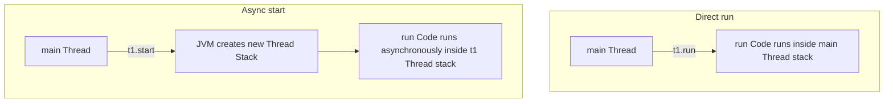

# Thread Priorities and Core Methods

## `start()` vs. `run()`

A common mistake is calling `run()` directly instead of `start()` to launch a thread:



* **`t.start()`**: Spawns a new OS-level thread, allocates a private execution Call Stack, and calls the `run()` method asynchronously inside the new stack.
* **`t.run()`**: Executes the `run()` method synchronously inside the **current calling thread** as a normal method call. No new thread is spawned.

---

## Core Thread Methods

### 1. `Thread.sleep(long millis)`
Pauses the currently executing thread for the specified duration.
* **Lock Behavior**: **`sleep()` does NOT release any monitor locks** that the thread currently holds.
* **Exceptions**: Throws checked `InterruptedException` if another thread interrupts the sleeping thread.

### 2. `t.join()`
Waits for the target thread `t` to die (terminate) before resuming execution of the current thread.
* **Use Case**: Used to coordinate tasks where the main thread must wait for sub-tasks to finish.

```java
Thread worker = new Thread(() -> System.out.println("Processing data..."));
worker.start();
worker.join(); // Main thread waits here until worker thread finishes
System.out.println("Data processed. Proceeding.");
```

### 3. `Thread.yield()`
A hint to the OS thread scheduler that the current thread is willing to yield its current use of the processor. The scheduler is free to ignore this hint.

---

## Thread Priorities

Each thread in Java has a priority, represented by an integer from **1 to 10**:
* `Thread.MIN_PRIORITY` = 1
* `Thread.NORM_PRIORITY` = 5 (Default)
* `Thread.MAX_PRIORITY` = 10

```java
Thread t = new Thread(task);
t.setPriority(Thread.MAX_PRIORITY);
```

* **Platform Dependency**: Thread priorities are **non-preemptive and platform-dependent**. The underlying OS scheduler can ignore priorities, so do not rely on them for application correctness.

---

## Daemon Threads

A **Daemon Thread** is a background provider thread that provides services to user threads (e.g. Garbage Collection).
* **Execution Contract**: The JVM will **automatically shut down** if the only remaining threads in the system are Daemon threads.
* **Setting Daemon**: Set the daemon status before calling `start()`:

```java
Thread daemonWorker = new Thread(() -> {
    while (true) {
        System.out.println("Background service running...");
    }
});
daemonWorker.setDaemon(true); // Must be set BEFORE start()
daemonWorker.start();
```

---

## Key Takeaways

* Call `start()` to spawn a thread; calling `run()` executes code synchronously in the current thread stack.
* `sleep()` pauses execution without releasing locks; `join()` blocks the caller until the target thread exits.
* Daemon threads are terminated automatically by the JVM once all user threads complete execution.

---

**Back to Module Index:** [Module Index](README.md)
