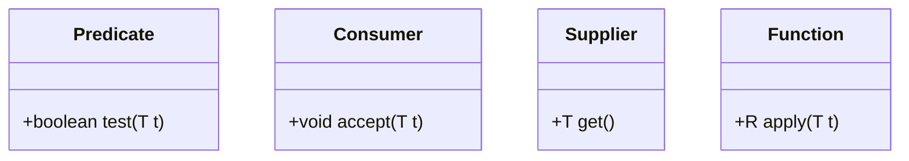

# Built-in Functional Interfaces in Java

To prevent developers from having to create custom interfaces for every common programming task, Java 8 provides a rich set of built-in functional interfaces in the **`java.util.function`** package.

---

## The Core Four

The framework revolves around four fundamental interfaces:



### 1. `Predicate<T>`
Represents a boolean-valued function that evaluates a single input.
* **Abstract Method**: `boolean test(T t)`
* **Use Case**: Filtering, validating conditions.
```java
Predicate<String> isEmpty = str -> str == null || str.isEmpty();
System.out.println(isEmpty.test("")); // true
```

### 2. `Consumer<T>`
Represents an operation that accepts a single input and returns no result (side-effect producer).
* **Abstract Method**: `void accept(T t)`
* **Use Case**: Printing, saving elements, modifying values.
```java
Consumer<String> printer = text -> System.out.println("Processing: " + text);
printer.accept("Java Docs"); // Prints: "Processing: Java Docs"
```

### 3. `Supplier<T>`
Represents a supplier of results. It accepts no input arguments but returns a value.
* **Abstract Method**: `T get()`
* **Use Case**: Lazy initialization, generating random numbers.
```java
Supplier<Double> randomValue = () -> Math.random();
System.out.println(randomValue.get()); // Prints a random double
```

### 4. `Function<T, R>`
Represents a function that accepts one argument of type `T` and produces a result of type `R`.
* **Abstract Method**: `R apply(T t)`
* **Use Case**: Mapping, transforming data from one type to another.
```java
Function<String, Integer> stringLength = str -> str.length();
System.out.println(stringLength.apply("Antigravity")); // Prints: 11
```

---

## Bi-Variants (Accepting Two Arguments)

If you need a functional interface that accepts two arguments instead of one, use these bi-variants:

| Interface | Abstract Method | Inputs $\rightarrow$ Output |
| :--- | :--- | :--- |
| **`BiPredicate<T, U>`** | `boolean test(T t, U u)` | Two parameters $\rightarrow$ `boolean` |
| **`BiConsumer<T, U>`** | `void accept(T t, U u)` | Two parameters $\rightarrow$ `void` |
| **`BiFunction<T, U, R>`** | `R apply(T t, U u)` | Two parameters $\rightarrow$ Result `R` |

```java
BiFunction<String, String, String> concat = (s1, s2) -> s1 + " " + s2;
System.out.println(concat.apply("Hello", "World")); // "Hello World"
```

---

## Primitive Specialization (Performance Optimization)

Generics in Java only support reference types, causing primitive types (like `int`, `double`) to undergo automatic boxing/unboxing overhead when used with standard interfaces.

To prevent this performance overhead, Java provides primitive specialized functional interfaces:
* **`IntPredicate`**: accepts `int` and returns `boolean` (prevents boxing to `Integer`).
* **`LongConsumer`**: accepts `long` and returns `void`.
* **`DoubleSupplier`**: returns `double`.

---

## Key Takeaways

* The `java.util.function` package contains common functional interfaces.
* **Core four**: `Predicate` (test), `Consumer` (accept), `Supplier` (get), and `Function` (apply).
* Bi-variants extend this structure to support two-parameter inputs.
* Primitive specializations (e.g. `IntPredicate`) bypass boxing/unboxing overhead.

---

**Back to Module Home:** [Module Index](README.md)
