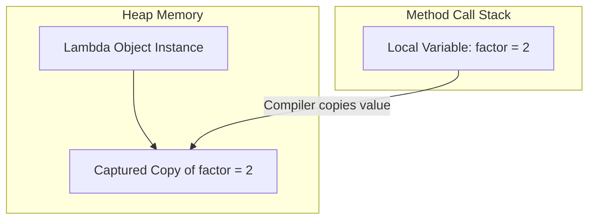

# Lexical Scoping and Variable Capture in Java

## Lexical Scoping

Unlike Anonymous Inner Classes, which define their own scope (introducing a new scope boundary), Lambda Expressions are **lexically scoped**. This means a lambda does not create a new scope. Its scope is identical to the enclosing block of code.

### The `this` Reference Behavior
* Inside an **Anonymous Inner Class**: `this` refers to the anonymous class instance object itself.
* Inside a **Lambda Expression**: `this` refers to the **enclosing class object instance** where the lambda is defined.

```java
public class ScopeDemo {
    private final String name = "Enclosing Class";

    public void testScope() {
        // Anonymous Inner Class
        Runnable r1 = new Runnable() {
            private final String name = "Anonymous Class";
            @Override
            public void run() {
                System.out.println(this.name); // Prints: "Anonymous Class"
            }
        };

        // Lambda Expression
        Runnable r2 = () -> {
            // System.out.println(this.name);
            // Prints: "Enclosing Class" because scope is lexical
            System.out.println(this.name); 
        };

        r1.run();
        r2.run();
    }

    public static void main(String[] args) {
        new ScopeDemo().testScope();
    }
}
```

---

## Variable Capture

A lambda expression can access variables defined in its enclosing scope. This is known as **Variable Capturing**.

### The "Effectively Final" Constraint
If a lambda expression accesses a local variable defined in the enclosing method, that variable **must be final or effectively final**.
* **Effectively Final**: A variable whose value is never changed after it is initialized.

```java
public void captureDemo() {
    int factor = 2; // Local variable on the stack

    // Valid: factor is never modified, so it is effectively final
    Runnable r1 = () -> System.out.println(factor * 10);

    int multiplier = 3;
    multiplier = 5; // Re-assigned

    // Compilation error: Local variable multiplier defined in an enclosing scope
    // must be final or effectively final
    // Runnable r2 = () -> System.out.println(multiplier * 10);
}
```

---

## Why does this constraint exist?

To understand the effectively final constraint, we must look at how Java allocates memory:



1. **Stack vs. Heap**: Local variables reside on the **Thread Call Stack** and are destroyed as soon as the method exits. Lambda objects reside on the **Heap** and can outlive the method execution context (e.g. if the lambda is run in a background thread later).
2. **Value Copying**: To prevent thread synchronization issues and ensure the variable remains available after the stack frame is popped, the compiler copies the local variable's value and attaches it to the lambda object.
3. **Preventing Out-of-Sync Conditions**: If the variable's value could be modified in the enclosing scope, the copy inside the lambda would become out-of-sync, leading to bugs. To avoid this, Java enforces that captured variables must be read-only (effectively final).

---

## Instance and Static Variables

This constraint **does not apply** to instance variables (fields) or static variables. Because these variables reside on the Heap, they remain alive as long as their enclosing class instance exists, so the compiler does not need to copy them:

```java
public class HeapCapture {
    private int instanceCount = 10; // Enclosing class field on Heap

    public void runTask() {
        Runnable r = () -> {
            instanceCount++; // Valid! No effectively final constraint
            System.out.println(instanceCount);
        };
        r.run();
    }
}
```

---

## Key Takeaways

* Lambdas are lexically scoped: `this` refers to the enclosing class instance, not the lambda.
* Local stack variables accessed inside lambdas must be final or effectively final.
* This constraint exists because local variables reside on the stack (and are short-lived), requiring the compiler to copy their values to the lambda object on the heap.
* Instance and static variables reside on the heap and are not subject to the effectively final constraint.

---

**Back to Module Home:** [Module Index](README.md)
