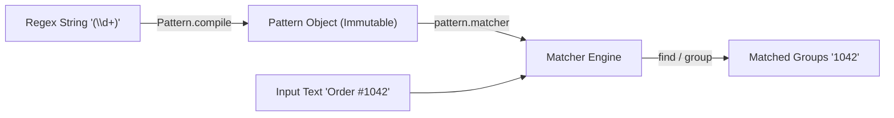

# Pattern and Matcher in Java

## The `java.util.regex` Package

Java provides built-in regex engines inside the **`java.util.regex`** package, consisting of two main classes:
1. **`Pattern`**: An immutable, compiled representation of a regular expression.
2. **`Matcher`**: An engine that interprets the `Pattern` and performs match operations against an input string.



---

## Compiling Patterns for Performance

Compiling a regex pattern involves parsing the string into a finite state machine. This compilation step is CPU-intensive.

* **Best Practice**: Never call `Pattern.compile()` repeatedly inside loops or high-frequency methods. Compile the pattern once and store it as a `private static final` constant:

```java
public class ValidationService {
    // Compiled ONCE at class loading time for high performance
    private static final Pattern ID_PATTERN = Pattern.compile("EMP-\\d{4}");

    public boolean isValidEmployeeId(String id) {
        return ID_PATTERN.matcher(id).matches();
    }
}
```

---

## Matcher Evaluation Methods

Once a `Matcher` instance is created using `pattern.matcher(input)`, you can evaluate matches using these key methods:

### 1. `matches()` vs. `find()` vs. `lookingAt()`
* **`matches()`**: Returns `true` only if the **entire input string** matches the pattern.
* **`find()`**: Scans the input string to locate the **next sub-sequence** that matches the pattern (returns `true` if found).
* **`lookingAt()`**: Returns `true` if the input string **starts** with a matching sub-sequence.

---

## Extracting Matched Groups (`group()`)

Parenthesis `()` in a regex pattern define **Capturing Groups**. 
* Group `0` represents the entire matched expression.
* Group `1`, `2`, ... represent sub-matches inside parenthesized groups from left to right.

```java
import java.util.regex.Matcher;
import java.util.regex.Pattern;

public class RegexGroupDemo {
    public static void main(String[] args) {
        String text = "User: Sanjay, Age: 25; User: John, Age: 30";
        
        // Group 1: Name, Group 2: Age
        Pattern pattern = Pattern.compile("User: (\\w+), Age: (\\d+)");
        Matcher matcher = pattern.matcher(text);

        // Iterate through all occurrences found in the string
        while (matcher.find()) {
            System.out.println("Full Match: " + matcher.group(0));
            System.out.println("Extracted Name: " + matcher.group(1));
            System.out.println("Extracted Age: "  + matcher.group(2));
            System.out.println("Found between index " + matcher.start() + " and " + matcher.end());
            System.out.println("----------------------------------------");
        }
    }
}
```

**Output:**
```text
Full Match: User: Sanjay, Age: 25
Extracted Name: Sanjay
Extracted Age: 25
Found between index 0 and 20
----------------------------------------
Full Match: User: John, Age: 30
Extracted Name: John
Extracted Age: 30
Found between index 22 and 41
----------------------------------------
```

---

## Key Takeaways

* Compile patterns using `Pattern.compile()` and reuse `Pattern` objects to avoid re-parsing overhead.
* Use `matches()` for full-string validation; use `find()` for scanning sub-strings.
* Use parenthesized capturing groups `()` and `matcher.group(n)` to extract matched components.

---

**Back to Module Home:** [Module Index](README.md)
