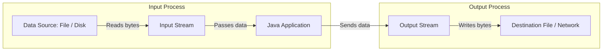
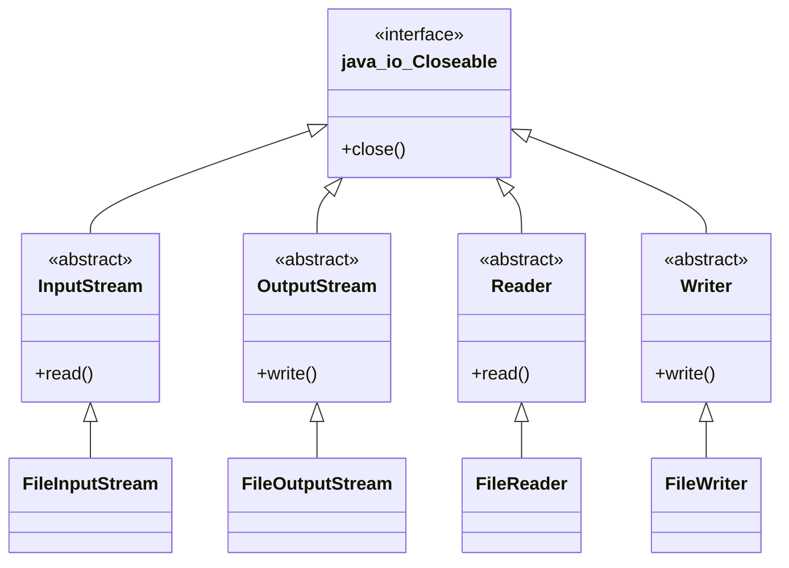

# Introduction to File Handling in Java

## Stream Abstraction

In Java, all File I/O operations are performed using **Streams**. A Stream is an abstract sequence of data items produced by a source and consumed by a destination.

---

## Byte Streams vs. Character Streams

Java divides I/O stream classes into two main categories based on the data unit they process:

| Feature | Byte Streams | Character Streams |
| :--- | :--- | :--- |
| **Data Unit** | 8-bit raw bytes. | 16-bit Unicode characters. |
| **Base Superclasses** | `InputStream` & `OutputStream` | `Reader` & `Writer` |
| **Primary Use Case** | Binary files (images, audio, videos, PDFs, `.class` files). | Plain text files (TXT, CSV, JSON, XML, Java source code). |
| **Encoding Support** | Ignores character encodings. Reads raw byte values. | Handles character encoding conversions (e.g. UTF-8, UTF-16). |

---

## Stream Class Hierarchy

---

## Key Takeaways

* A **Stream** is a continuous sequence of data flowing from a source to a destination.
* **Byte Streams** (`InputStream`/`OutputStream`) process 8-bit bytes for binary data.
* **Character Streams** (`Reader`/`Writer`) process 16-bit Unicode characters for text data.

---

**Back to Module Home:** [Module Index](README.md)
