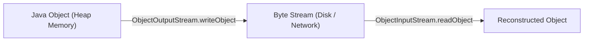

# Serialization and Deserialization in Java

## What is Serialization?

* **Serialization**: The process of converting the in-memory state of an object into a sequence of bytes. This byte stream can be saved to a file or transmitted across a network.
* **Deserialization**: The reverse process of reconstructing an in-memory Java object from a stream of bytes.



---

## The `Serializable` Interface

To make a class serializable, it must implement the **`java.io.Serializable`** interface. 

`Serializable` is a **Marker Interface**—it defines no methods or fields. It signals to the JVM that instances of this class can be safely converted to bytes.

```java
import java.io.Serializable;

public class User implements Serializable {
    private String username;
    private transient String password; // Excluded from serialization
}
```

---

## The `transient` Keyword

Field members marked with the **`transient`** keyword are **ignored** during the serialization process. 
* When the object is deserialized, transient fields are assigned their default values (`null` for references, `0` for numeric primitives, `false` for booleans).
* **Use Case**: Exclude sensitive information (e.g. passwords, secret keys) or non-serializable references (e.g. database connections, thread locks).

---

## `serialVersionUID`

`serialVersionUID` is a unique 64-bit integer constant used to verify that the sender and receiver of a serialized object have loaded compatible classes:

```java
private static final long serialVersionUID = 1L;
```

* If you do not explicitly define a `serialVersionUID`, the compiler auto-generates one based on class attributes. However, if you modify the class later (e.g. adding a field), the auto-generated ID changes, causing an **`InvalidClassException`** during deserialization.
* **Best Practice**: Always define an explicit `serialVersionUID`.

---

## Complete Code Example

```java
import java.io.FileInputStream;
import java.io.FileOutputStream;
import java.io.ObjectInputStream;
import java.io.ObjectOutputStream;
import java.io.Serializable;

class Employee implements Serializable {
    private static final long serialVersionUID = 101L;

    private String name;
    private double salary;
    private transient String ssn; // Will NOT be saved

    public Employee(String name, double salary, String ssn) {
        this.name = name;
        this.salary = salary;
        this.ssn = ssn;
    }

    @Override
    public String toString() {
        return "Employee{name='" + name + "', salary=" + salary + ", ssn='" + ssn + "'}";
    }
}

public class SerializationDemo {
    public static void main(String[] args) {
        String filename = "employee.ser";
        Employee emp = new Employee("Sanjay", 85000.0, "123-45-6789");

        // 1. Serialization
        try (ObjectOutputStream oos = new ObjectOutputStream(new FileOutputStream(filename))) {
            oos.writeObject(emp);
            System.out.println("Serialized: " + emp);
        } catch (Exception e) {
            e.printStackTrace();
        }

        // 2. Deserialization
        try (ObjectInputStream ois = new ObjectInputStream(new FileInputStream(filename))) {
            Employee deserializedEmp = (Employee) ois.readObject();
            System.out.println("Deserialized: " + deserializedEmp);
            // Notice ssn is null because it was marked transient!
        } catch (Exception e) {
            e.printStackTrace();
        }
    }
}
```

---

## Key Takeaways

* Classes must implement `java.io.Serializable` to enable object I/O.
* Use `transient` to exclude sensitive or non-serializable fields.
* Define `serialVersionUID` explicitly to maintain class compatibility across code updates.

---

**Back to Module Home:** [Module Index](README.md)
